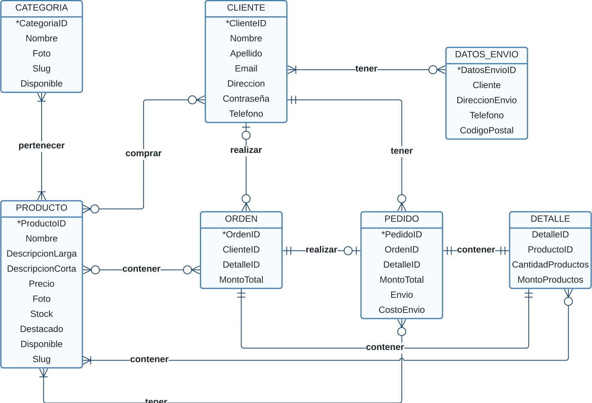

# Database schemas

## Entity Relationship Diagram

## Relational Model Schema

CATEGORIA( <u>CategoriaID</u>, Nombre, Foto, Slug, Disponible )

PRODUCTO( <u>ProductoID</u>, Nombre, DescripcionLarga, DescripcionCorta, Precio, Foto, Stock, Destacado, Disponible, Slug)

CATEGORIA_PRODUCTO( <u>CategoriaID</u>(fk), <u>ProductoID</u>(fk) )  

CLIENTE(<u>ClienteID</u>, Nombre, Apellido, Email, Direccion, Contraseña, Telefono)  

CLENTE_PRODUCTO(<u>ClienteID</u>(fk), <u>ProductoID</u>(fk))  

ORDEN(<u>OrdenID</u>, ClienteID(fk), DetalleID(fk), MontoTotal)  

ORDEN_PRODUCTO(<u>OrdenID</u>(fk), <u>ProductoID</u>(fk))  

PEDIDO(<u>PedidoID</u>, OrdenID(fk), DetalleID(fk), MontoTotal, Envio, CostoEnvio, ClienteID(fk))  

PEDIDO_PRODUCTO(<u>PedidoID</u>(fk), <u>ProductoID</u>(fk))

DETALLE(<u>DetalleID</u>, ProductoID, CantidadProductos, MontoProductos)  

DATOS_ENVIO(<u>DatosEnvioID</u>, Cliente, DireccionEnvio, Telefono, CodigoPostal)  

CLENTE_DATOS_ENVIO(<u>ClienteID</u>(fk), <u>DatosEnvioID</u>(fk))  

DETALLE_PRODUCTO(<u>DetalleID</u>(fk), <u>ProductoID</u>(fk))

